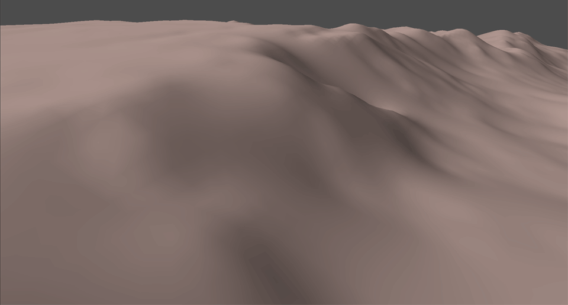
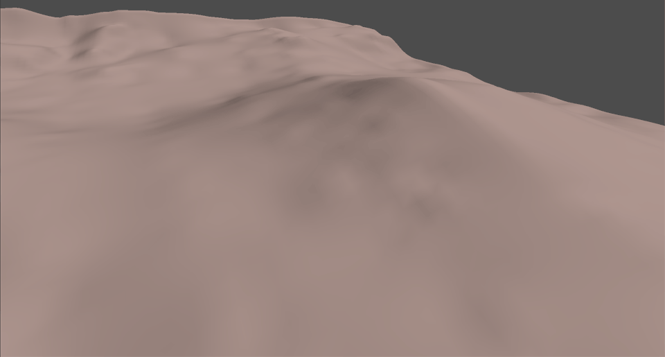

# Digital elevation model enhancement

This is an implementation of the paper [Digital Elevation Model enhancement using Deep Learning](https://arxiv.org/abs/2101.04812).

## What does this do?

The script takes an initial elevation model and iteratively improves its spatial resolution by combining it with high resolution 2D images of the surface using deep learning. At each step there is a 2x improvement in resolution.

The base elevation model is expected to be the 463m resolution [MOLA DEM](https://astrogeology.usgs.gov/search/details/Mars/GlobalSurveyor/MOLA/Mars_MGS_MOLA_DEM_mosaic_global_463m). This is based on data collected by Mars Global Surveyor's Mars Orbiter Laser Altimeter instrument.

The high resolution surface imagery used is the 5m resolution data set from the [Murray Lab](http://murray-lab.caltech.edu/CTX/index.html), based on images collected by the [Context Camera](https://mars.nasa.gov/mro/mission/instruments/ctx/) on the Mars Reconnaissance Orbiter.

## How to use it?

ctxEnhanceScript _latitude_ _longitude_start_ _longitude_end_

## Samples

Here are some images to compare the enhanced (28m resolution) tiles to the original MOLA section (463m resolution).

